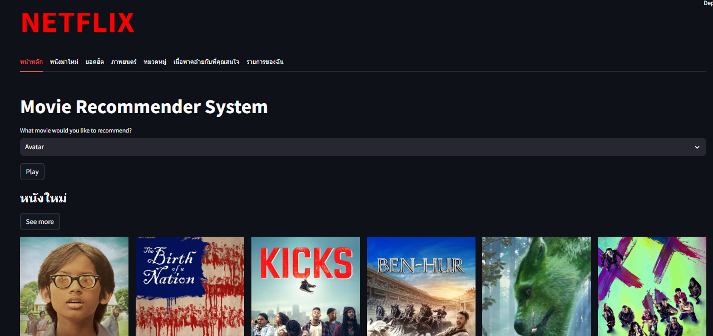

# **Movie Recommend System**

### **Project : Movie Recommendation System**

For this project, I developed a movie recommendation system with the aim of refining my skills and creating a practical application for my daily life. While similar projects abound, I sought to implement and enhance a pattern recommendation system, specifically focusing on content-based filtering.

The content-based filtering system analyzes the similarity of sentences, descriptions, or keywords of movies in pairs. By comparing these elements, a matrix table or a similar word index table is generated to facilitate recommendations. Essentially, this approach extends the Cosine Similarity matrix table. Upon user engagement, the system suggests similar items by leveraging the matrix table, identifying the highest similarity value for recommendation.

Additionally, I incorporated a movie introduction feature in this project. This feature provides supplementary recommendations, such as movies by the same director, movies of the same genre, those from the same country, newly released films, and more. Furthermore, I introduced a Hybrid system, which combines various recommendation factors. This system considers not only the content of the movie but also factors like user ratings and overall popularity. This multifaceted approach adds flexibility to the recommendations, catering to diverse user preferences.

In summary, this project showcases my proficiency in developing a sophisticated movie recommendation system that goes beyond conventional content-based filtering, offering a more nuanced and user-centric experience.

## **How to Use**
1. Open the command prompt (cmd) and navigate to the folder where you want to store the project. For example, use the following command: cd 'path/to/your/directory'
2. Clone the project repository by entering the command: git clone https://github.com/alexday11/movie-recommend-system.git
3. Move into the project directory: cd 'movie-recommend-system'
4. Start the application by running the following command in the command prompt: streamlit run app.py

