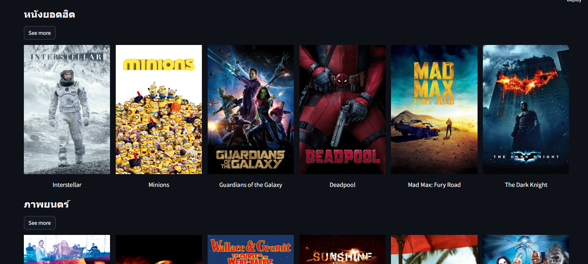
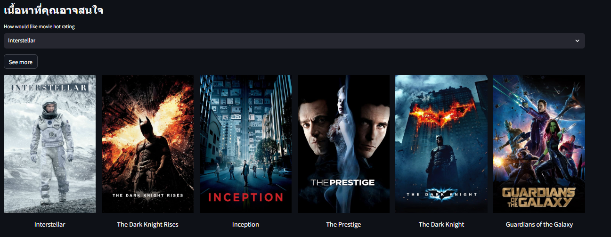

# **Movie Recommend System**

### วิธีการใช้งาน ###
1. เปิด cmd แล้วเข้าถึงโฟล์เดอร์ที่จะเก็บโปรเจ็ค Ex: cd 'path/to/your/directory'
2. git clone https://github.com/alexday11/movie-recommend-system.git
3. cd 'movie-recommend-system'
4. pip install -r requirements.txt
5. unzip similarity.zip
6. เริ่มแอปโดยการใช้คำสั่งในcmd  streamlit run app.py

### ตัวอย่าง

